# Week 1 Lab

# Contents
* Introduction
* Downloading the git repositories
* Setting up the data analysis environment
* Setting up the Android Development environment
* Connecting to the sensors
* Collecting some test data
* Obtaining the data from the phone

# Introduction

Welcome to the PDIoT course! You will experience the different facets of designing and 
implementing a complex IoT system, from data collection (Coursework 1) and system 
specification to demonstration of a prototype implementation, over the course of 
10 weeks (Coursework 3). The practical work will be complemented by knowledge gained
through personal research on foundational topics in Internet of Things to be 
distilled in one 3000-word essays (Coursework 2).

Each student will be provided the following for Coursework 1 & 3:
* A wearable Respeck sensor
* Respeck accessories: plastic bags and MeFix tape
* An mBed development board (NRF52-DK)
* A Nordic Cube (Thingy)
* The on-line ARM mBed compiler and software development environment.

You will need a smarphone running Android 6.0 or higher to run the apps needed for the course. 
If no one from your team owns an Android phone we can provide you with one upon a special request.


This year, your task will be to implement a human activity recognition system for a range of 
common activities listed below by analysing data from a wearable sensor using machine learning 
techniques and displaying the results in real-time in an Android application.

The activities to be recognised are:
* Sitting (straight, bent forward, bent backward)
* Standing
* Lying down (left, right, on the back, on the front)
* Walking
* Running/Jogging
* Ascending and descending stairs
* Desk work (working at a computer, writing, etc.)
* General movement (sudden turns, bending down, getting up from chairs, anything else that doesn't qualify as an activity)
* Falling (on the knees, on the back, on the sides)

You will first collect data using two sensors:
* the **Respeck** sensor, worn on the lower left ribcage, sampling accelerometer and gyroscope data at 25Hz 
* the **Thingy** sensor, worn in the front right pocket of your trousers, sampling accelerometer, gyroscope and magnetometer data at 25Hz.

The data collection part comprises Coursework 1 and will be graded according to the quality of the data you collected.

This data will be stored on a common repository where everyone in this class will have access to it
for training their models. The data collection will mostly take place during Labs 1 and 2 where the Lab Demonstrator will
make sure everyone is performing the activities correctly. The data collection protocol is provided in the Lab file.

You will then develop data analysis and machine learning methods for identifying the different types of activities. 

At this point you will have a choice between:
* developing Machine Learning models using the Respeck data and running the models on the Android app
* developing Machine Learning models using the Thingy data and running the models on the Thingy firmware.

You will be briefly introduced to embedded programming concepts and you will be able to modify the Thingy
firmware using the mBed development board.

Use this week's tutorial to set up your development environment and to start collecting data.

# Git repository

A list of supporting files are available from the following GitHub [repository](https://github.com/specknet/pdiot-practical). In case the data collection app is missing after cloning visit this [repository](https://github.com/specknet/pdiotapp).

You are encouraged to use version control for your own work. A short tutorial on Git and Github can be found [here](https://www.freecodecamp.org/news/what-is-git-and-how-to-use-it-c341b049ae61/).

Start by cloning this repository:
1. Open the terminal app.
2. Navigate to the folder where you wish to have the files using the terminal.
3. Run ```git clone https://github.com/specknet/pdiot-practical.git``` to get the repo.
4. Type ```git submodule init``` and ```git submodule update``` to download the Android app as well.
4. Now all the files can be found in the "pdiot-practical" folder.

Alternatively you can download the files in the following way:
1. Go to the link above.
2. Click the "Clone or Download" button.
3. Select the "Download as ZIP.
4. Save and unarchive the file.
5. On the Github page click on "pdiotapp", which will take you to the code for the Android app.
6. Once on the "pdiotapp" page proceed similarly and download the files as zip.
7. Unarchive the files inside the "pdiot-practical" folder.
8. You should now have all the required files in their place.

# Data Analysis

### 1. If you don't already have it then Install conda
1. **Check you don't already have conda installed!**
    1. `which conda`
    2. **if you already have it installed, skip ahead to Create an Environment**
    3. It doesn't matter if you have miniconda3, or anaconda3 installed (it does not even matter if it is version 2).
2. If you don't have conda, download the latest version of miniconda3
    1. `cd ~/Downloads` (you can make a Downloads folder if you don't have one)
    2. Download the installer (we prefer to use miniconda since it carries less baggage), depending on your system (you can check links [here](https://conda.io/miniconda.html)):
        * Linux: `wget https://repo.continuum.io/miniconda/Miniconda3-latest-Linux-x86_64.sh`
        * Mac: `wget https://repo.continuum.io/miniconda/Miniconda3-latest-MacOSX-x86_64.sh` or ```curl -LOk https://repo.continuum.io/miniconda/Miniconda3-latest-MacOSX-x86_64.sh```
        * Or just simply download from [the site](https://conda.io/miniconda.html)
3. Install miniconda3 *with default settings*
    1. `bash Miniconda3-latest-Linux-x86_64.sh`
    2. Follow the prompt - **type `yes` and hit `enter` to accept all default
    settings when asked**
4. Close Terminal and reopen
5. Try executing `conda -h`. If it works, you can delete the installer
`rm ~/Downloads/Miniconda3-latest-Linux-x86_64.sh`

### 2. Create an environment for PDIoT
1. Update conda: `conda update conda`
2. Create the environment for the course. Call it pdiot and install python 3:
`conda create -n pdiot python=3.7`

### 3. Err...what's an environment?
An environment is a collection of packages of specific versions. You can have
multiple environments and switch between them for different projects. Conda is
a tool for managing both environments *and* the packages within each
environment. Here's a quick intro:

1. Show a list of your environments: `conda env list`
2. Print `$PATH`, one of your system's [environment variables](https://en.wikipedia.org/wiki/Environment_variable), in the
terminal: `echo $PATH`
    * `$PATH` is the list of directories your terminal can search to find
anything you execute:
3. Print a list of python installations on your `$PATH` (the top one is the one
    that will get executed if you type `python` in the terminal):
    `which python -a`
4. Activate the new environment: `source activate pdiot`
5. Show list of python installations on your system *now*: `which python -a`
6. Show your system `$PATH` again: `echo $PATH`
7. Deactivate the new environment: `source deactivate`
8. Observer how your $PATH has changed again: `echo $PATH`
9. Make an empty environment: `conda create --name empty`
10. You can clone environments; this is useful for backing up: `conda create
--name empty_bkp --clone empty`
11. Make another python 3 environment with numpy already installed: `conda create
--name py3 python=3.7 numpy`
12. `conda env list`
13. Activate py3: `source activate py3`
14. Show the installed packages: `conda list`
15. Switch environments: `source deactivate; source activate empty`
16. `conda list` to show packages (note that python and, crucially,
    [pip](https://pip.pypa.io/en/stable/) are not installed)
17. Q: What python would get used now? `which python` A: the conda root
environment installation of python i.e. *not* this environment's python.
18. Install numpy: `conda install numpy`
19. Q: What python would get used *now*? `which python` A: You may have clocked
that conda installed a dependency of numpy (a python package)...python!
20. Let's delete these test environments:
    * `source deactivate`
    * `conda env list`
    * `conda remove --name empty --all`
    * `conda remove --name empty_bkp --all`
    * `conda remove --name py3 --all`
    * `conda env list`

### 4. Recommended setup
* Conda environment with python 3.7
* Jupyter notebooks + [Numpy](https://docs.scipy.org/doc/numpy-1.17.0/numpy-user-1.17.0.pdf) +
  [Pandas](https://pandas.pydata.org/) + [Matplotlib](https://matplotlib.org/tutorials/introductory/pyplot.html#sphx-glr-tutorials-introductory-pyplot-py) + [Tensorflow2](https://www.tensorflow.org/install).

# Android setup

## 1. If you don't already have it - Install Android Studio

It is recommended that you use Android Studio. The IDE can be downloaded from [here](https://developer.android.com/studio/).

## 2. Phone

You need an Android phone running Android 6.0 or higher to complete this course. Teams will be formed
so that at least one team mate has an Android phone. If there are still teams without a phone we can 
provide you with one (Redmis).

You should enable [Developer Options](https://developer.android.com/studio/debug/dev-options) on your phone to be able to install and debug via USB.

## 3. Test-building the PDIoT App

In order to test that the environment has been set up properly, we will build the app from Android Studio directly onto your smartphone.

1. Open Android Studio
2. Open the pdiotapp project which has been downloaded along with the rest of the files
3. Connect the phone to the computer using a USB cable.
4. Check that you can see the phone being connected in the top right corner of Android Studio.
5. Press on the "Run App" button, which can be found in the top right-hand part of the Android Studio interface. This will compile the code and install the app on the phone.
6. Unlock the phone and open the app.
7. If the app builds successfully and you can see the welcome screen of the app, your environment has been set up correctly.

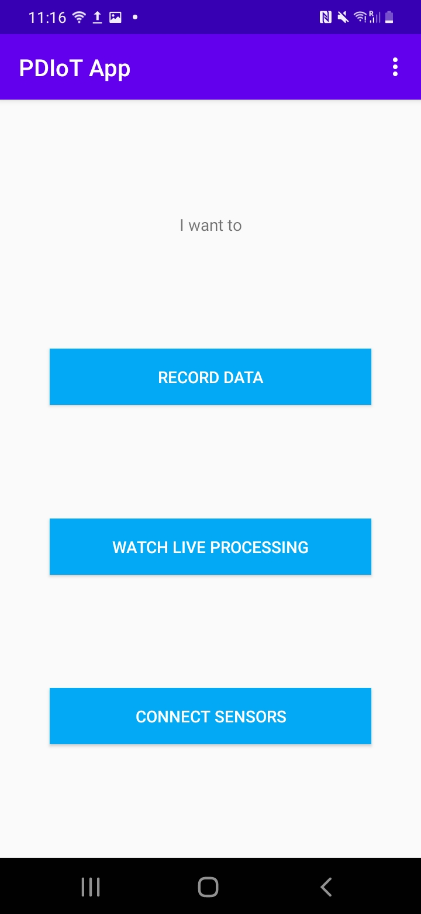

## 4. Connecting to the Thingy through the Thingy:52 app

### Obtaining the App
We first need to connect to the Thingy through the official app in order to set its sampling rate to 25Hz.

You can read more about the Thingy:52 [here](https://www.nordicsemi.com/Products/Development-hardware/Nordic-Thingy-52). 
It contains multiple types of sensors but we will be mainly working with its motion package.

Download the Thingy:52 app from [Google Play Store](https://play.google.com/store/apps/details?id=no.nordicsemi.android.nrfthingy&hl=en_GB&gl=US).
Alternatively, you can download the [code from GitHub](https://github.com/NordicSemiconductor/Android-Nordic-Thingy) and 
build the app directly on your phone. 

### Turning the Thingy on
Remove the black rubber case of the Thingy. You will find a switch on its bottom side.

When the Thingy is on, but not yet connected to any app, it will blink <span style="color:blue">*blue*</span>. When it's connected, it will blink <span style="color:green">*green*</span>.
. 

### Setting the motion processing unit frequency to 25Hz
* Connect your Thingy to the app by following the instructions. 
* Then, navigate to “Configuration” in the sidebar menu. 
  
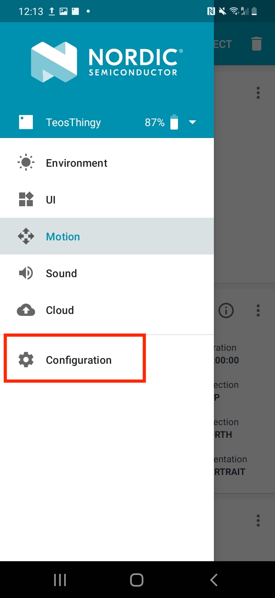


* Switch to the “Advanced” tab and find the “Motion processing unit frequency” under “Motion settings”. 

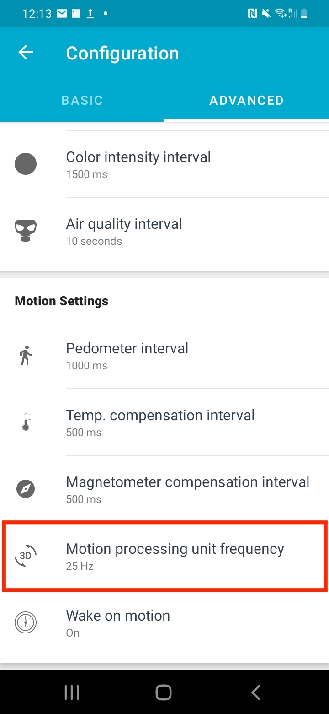

* Set this to 25Hz and click “Confirm” to apply the setting. 

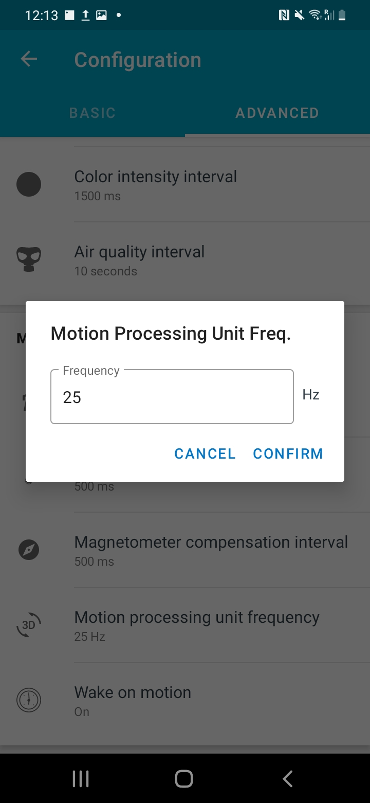

Your Thingy is running at 25Hz now, to match the frequency of the Respeck sensor.

### Disconnecting from the Thingy:52 app

It's important to make sure that your sensors are not connected to any other apps or phones when you
are trying to pair with them. Make sure you disconnect your Thingy from the Thingy:52 app by pressing the
*Disconnect* button in the top right corner of the main screen.

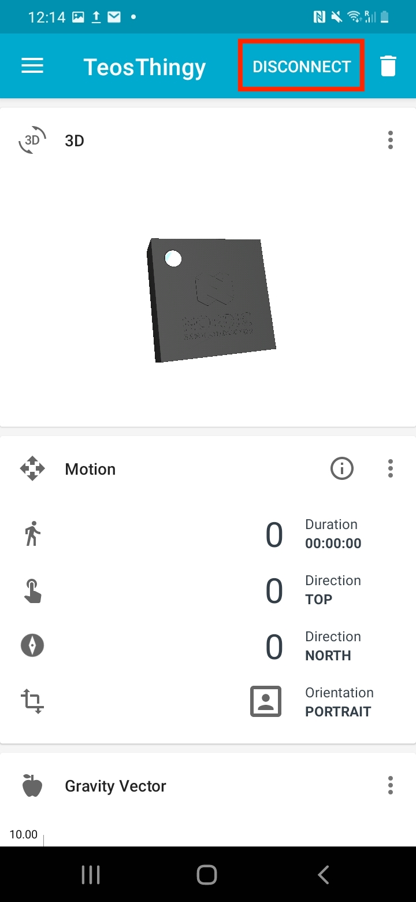

## 5. Connecting to the sensors through the PDIoT app

When you first start the application, you will need to connect it to the Respeck and the Thingy. 
Do so by navigating to the *Connect Sensors* activity. Here you will see two fields where you need to 
input the Respeck ID and the Thingy ID, respectively.

<p float="left">
  
   
</p>

You have multiple choices for connecting the sensors:
* NFC pairing if your phone supports NFC
* Scanning the QR code of the Respeck
* Manually input the IDs into the fields

You should only need to pair these sensors once. Their IDs will be remembered by the app whenever you start it again. 

Make sure the sensors are both on:
* Respeck – move the sensor around and it should blink <span style="color:green">*green*</span> when it wakes up
* Thingy – turn on using the switch on the bottom left edge and it should blink <span style="color:blue">*blue*</span> when it is on


### NFC Pairing

If your phone supports NFC you can simply tap it against the white surface of the Respeck to 
get the Respeck ID autocompleted in the corresponding field.

<p float="left">
  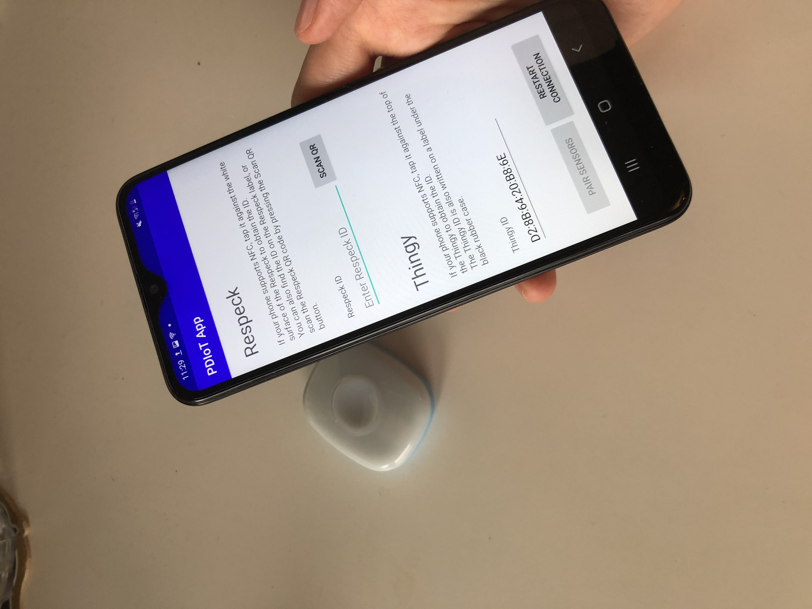
   
</p>

Similarly, you can tap the phone on the front side of the Thingy (here shown without the rubber case) 
to get the Thingy ID autocompleted in the corresponding field.

<p float="left">
  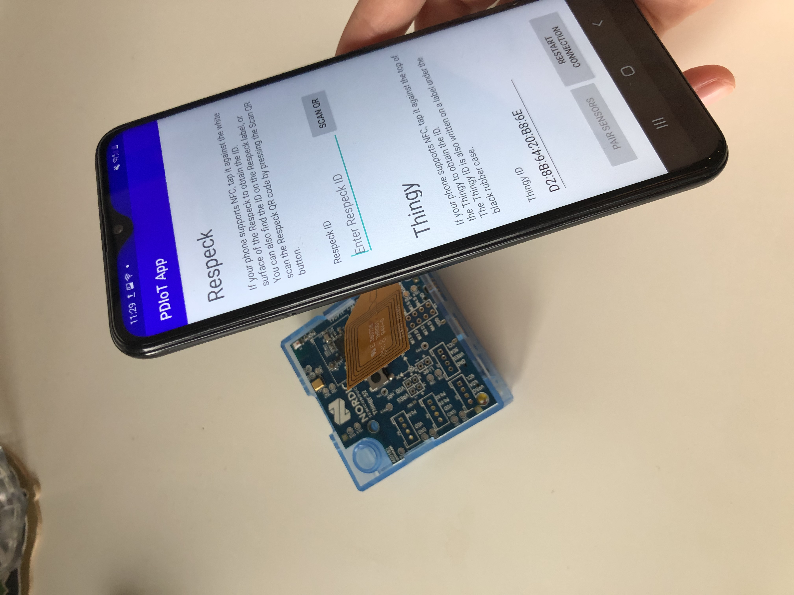
   
</p>

### Scanning the Respeck QR code

If your phone does not support NFC, you can scan the QR code of the Respeck instead.

Every Respeck should have a QR code printed on its back. By pressing the Scan QR button, 
a camera view will pop up and you will be able to scan the Respeck QR code to pair it to 
your app. Only one Respeck can be paired with an app at one time. 

<p float="left">
   
  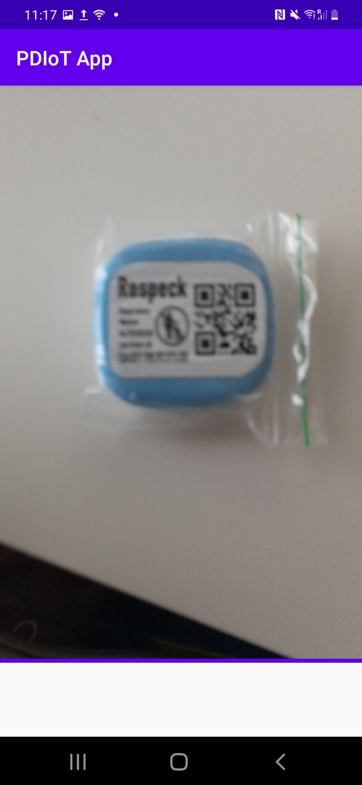
</p>

### Finding the Thingy ID

Unfortunately the Nordic Cubes do not have a QR code attached to them but you can find their ID (MAC address) 
on a label under the rubber case and NFC tag, as shown in the picture below.

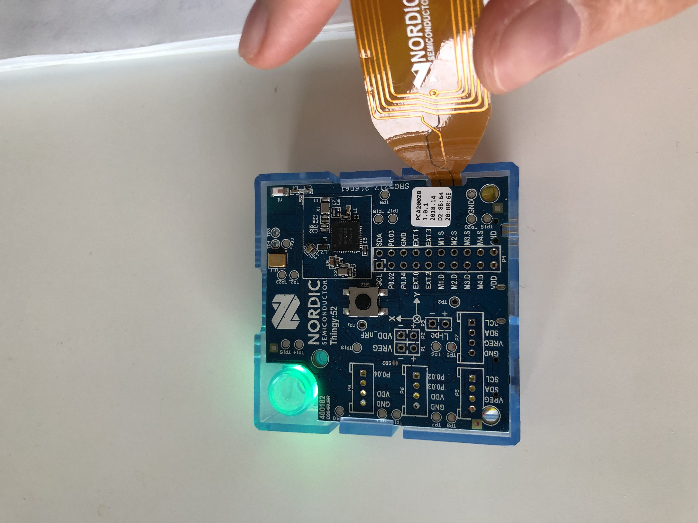

You need to manually input this code under the “Thingy ID” field. 

### Establishing the connection
Once you have entered both sensors’ IDs you will be able to click the button *Pair sensors* 
to start the Bluetooth service and connect to the sensors. 

If you ever need to change the sensors you can scan the IDs of the new sensors and click on 
*Pair sensors* again. This will restart the service with the new IDs.
If you have any connection issues, you can click on *Restart connection* to restart the 
Bluetooth service forcefully. 

The sensors have differently coloured LEDs that change with connection states.

Thingy:
* <span style="color:blue">*Blue*</span> light -> sensor ON and NOT CONNECTED
* <span style="color:green">*Green*</span> light -> sensor ON and CONNECTED
* No light -> sensor OFF

Respeck:
-	<span style="color:green">*Green*</span> light blink -> sensor ON and NOT CONNECTED
-	<span style="color:blue">*Blue*</span> light -> sensor ON and CONNECTED
-	<span style="color:red">*Red*</span> light -> sensor ON and DISCONNECTED

So, when you connect to them, you have to watch out for the Thingy to blink 
<span style="color:green">*green*</span> and the Respeck to blink <span style="color:blue">*blue*</span>.

## 6. Viewing live data

You can view incoming data from both sensors in the “Watch live processing” activity. 
This will show you two live graphs of the accelerometer data from the Respeck (top) and 
Thingy (bottom). Both sensors should run at 25Hz.

<p float="left">
   
  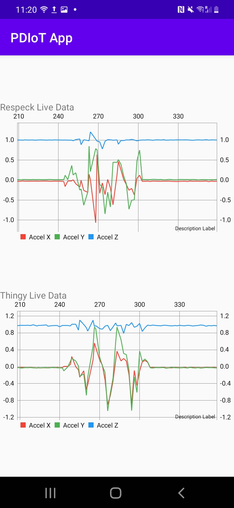
</p>

## 7. Sensor placement

### Respeck

Everyone will need to wear the sensors in the same places to ensure consistency across the data.

The **Respeck** sensor should be placed on the **left lower ribcage**, with the blue half against the skin. 
Make sure that the Respeck is first put into the small plastic bag provided. 
You should be able to read the Respeck label when placing it on your chest – this ensures 
the sensor is held the right way up, as shown in the figure below. 

Secure the sensor to the chest using the MeFix tape provided. 
If you run out of tape you should let us know and we will provide you with more. 


### Thingy

The Thingy sensor should be placed in the front right pocket of your trousers, with the circle placed in the upper right 
corner and the USB port facing downwards.


## 8. Recording data

Finally, you can record data in the *Record Data* activity. 
Choose the appropriate Sensor type and Activity and please use the university student 
number as the subject ID. You can enter any additional notes you have about the upcoming 
recording. 

You will be able to verify that your sensors are running as expected by watching the 
Live Data fields at the bottom of the screen.

<p float="left">
   
  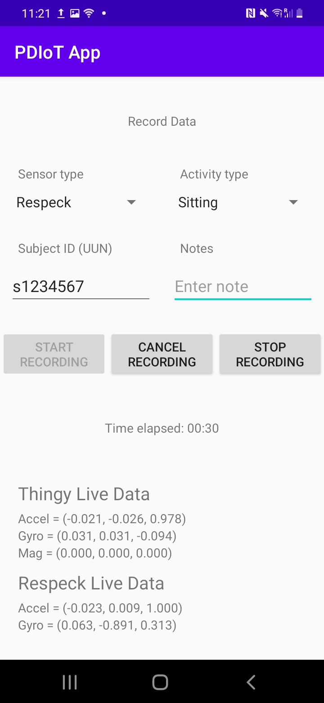
</p>

Hit Start Recording when you are all set up.
When you are done with a recording, hit *Stop Recording*. If something goes wrong during the 
recording you can cancel it by pressing the *Cancel Recording* button.

Check out the [instructions from Lab 2](./Week%202%20Lab.md) for the detailed list of activities and more information 
about how to redo recordings.

For now, record a couple of activities of your choice.

## 9. Obtaining the recorded files
Files are saved on the phone’s internal memory as csv files, on the path:
`Android > app > data > com.specknet.pdiotapp > files > Filename.csv`

You can access these files either by:
* connecting your phone to a computer via USB and checking the internal memory, or
* navigating to this folder from a file browser app on your phone and send them via Bluetooth, email, message etc. 

Depending on which Android version you are running, you might need additional apps rather than 
the pre-installed ones to get to these files. 
From Android version 11, you should use apps like [Total Commander](https://play.google.com/store/apps/details?id=com.ghisler.android.TotalCommander&hl=en_GB&gl=US) 
to view hidden system files. 
Any Android version lower than 11 will allow you to see these files in a normal file browser 
on your phone. 

The filename is formatted as follows: 
`{sensorType}_{studentID}_{activityType}_{timestamp}.csv`

This should ensure that each file has a unique name among all students. 

If you are using a Redmi phone provided by us and you need to obtain the files via USB you 
might need to restart the phone to see the new files appear in the file browser on your computer.

# Next up

Head over to [Lab 2](./Week%202%20Lab.md) to start collecting data and learn how to analyse it.
